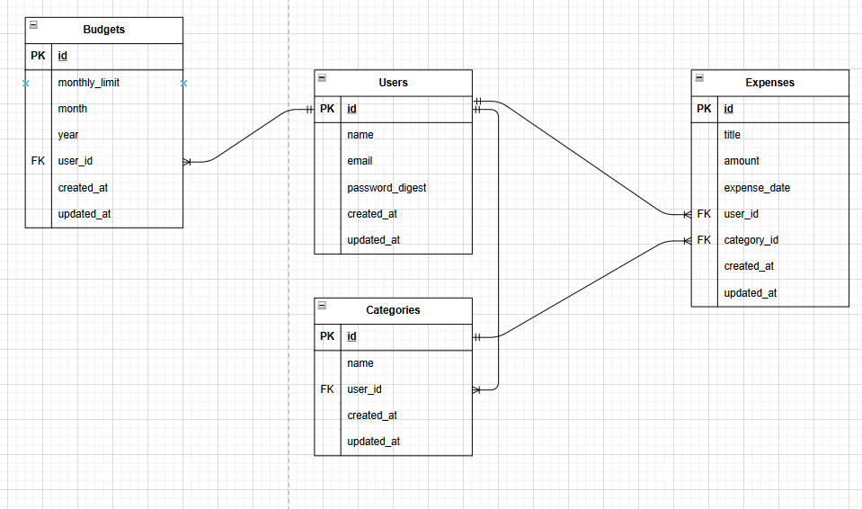
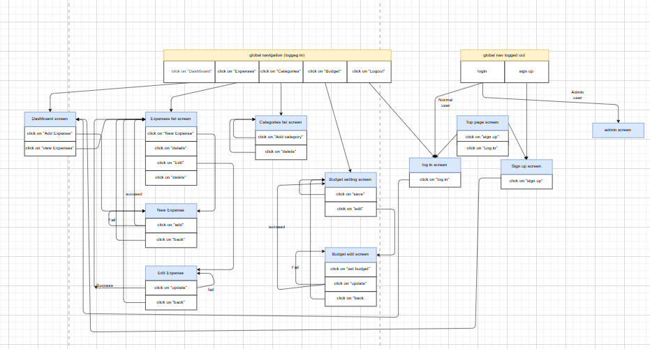

# SpendLess

Expense Management Application built with Ruby on Rails.

---

# Application Overview

**SpendLess** is a web application designed to help users manage their daily expenses, set monthly budgets, and understand their spending habits.

The application solves the problem of losing track of personal finances by providing:

- Expense tracking
- Category management
- Monthly budget setting
- Spending overview dashboard
- Administrator management screen

---

# Development Environment

- **Ruby:** 3.0.1
- **Ruby on Rails:** 7.1.5
- **Database:** PostgreSQL
- **Testing:** RSpec

---

# Application Setup Procedure

Follow the steps below to run the application locally.

## 1. Clone the Repository

```bash
git clone https://github.com/obunde/expense_man_app.git
cd expense_man_app
```

## 2. Install Dependencies

```bash
bundle install
```

## 3. Setup Database

```bash
rails db:create
rails db:migrate
```

## 4. Start the Server

```bash
rails s
```

Access the application in your browser:

http://localhost:3000

---

# Requirement Definition Materials

## Check Sheet

**Shared Link:**  
https://docs.google.com/spreadsheets/d/1vsLMcXfkvqUV8gGIvpTWVEtd3sTW7fz06KOgO74YFCo/edit?usp=sharing

---

## Catalog Design

**Shared Link:**  
https://docs.google.com/spreadsheets/d/1vsLMcXfkvqUV8gGIvpTWVEtd3sTW7fz06KOgO74YFCo/edit?usp=sharing

---

## Table Definition

**Shared Link:**  
https://docs.google.com/spreadsheets/d/1vsLMcXfkvqUV8gGIvpTWVEtd3sTW7fz06KOgO74YFCo/edit?usp=sharing

---

## Wireframe

**Shared Link:**  
https://cacoo.com/diagrams/Ql8jeHXKdwt1r17B/16003

---

# ER Diagram

Below is the ER diagram representing the relationships between tables.



---

# Screen Transition Diagram

Below is the screen transition diagram representing the application flow.



---

# Application Features

## User Authentication

- Sign up
- Login
- Logout

## Expense Management

- Create expense
- Edit expense
- Delete expense
- View expense list

## Category Management

- Create category
- Manage categories

## Budget Setting

- Set monthly budget
- Monitor spending

## Administrator Screen

- Admin Dashboard (rails_admin first screen only)
- User Management
- Expense Management

---

# Notes

- The administrator screen is implemented using `rails_admin`.
- Only the first admin screen is described in the screen transition diagram as required by the assignment.
- All high-priority functions are planned to be tested using RSpec.
